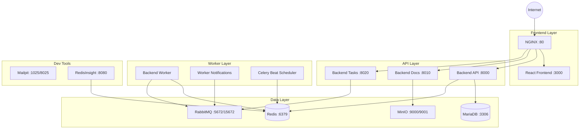

# 🏭 Sistema de Inventario v1.0

[](https://www.docker.com/)
[](https://python.org/)
[](https://nodejs.org/)
[](LICENSE.md)

Sistema completo de gestión de inventarios desarrollado con arquitectura de microservicios, utilizando contenedores Docker para garantizar portabilidad, escalabilidad y facilidad de despliegue.

## 📋 Tabla de Contenidos

- [🚀 Características Principales](#-características-principales)
- [🏗️ Arquitectura del Sistema](#️-arquitectura-del-sistema)
- [🛠️ Tecnologías Utilizadas](#️-tecnologías-utilizadas)
- [📁 Estructura del Proyecto](#-estructura-del-proyecto)
- [⚡ Inicio Rápido](#-inicio-rápido)
- [🔧 Configuración Detallada](#-configuración-detallada)
- [🌐 Servicios y Puertos](#-servicios-y-puertos)
- [📚 Documentación](#-documentación)
- [🤝 Contribuciones](#-contribuciones)
- [📄 Licencia](#-licencia)

## 🚀 Características Principales

- ✅ **Arquitectura de Microservicios** con separación clara de responsabilidades
- ✅ **Procesamiento Asíncrono** con Celery para tareas de background
- ✅ **Storage S3-Compatible** con MinIO para gestión de archivos
- ✅ **Cache Distribuido** con Redis para optimización de rendimiento
- ✅ **Message Queue** con RabbitMQ para comunicación entre servicios
- ✅ **Base de Datos Robusta** con MariaDB 10.6
- ✅ **Reverse Proxy** con NGINX para balanceado de carga
- ✅ **Hot Reload** en desarrollo para frontend y backend
- ✅ **Health Checks** automáticos para todos los servicios
- ✅ **Herramientas de Desarrollo** integradas (Mailpit, RedisInsight)

## 🏗️ Arquitectura del Sistema



## 🛠️ Tecnologías Utilizadas

### Backend Services
| Servicio | Tecnología | Versión | Función |
|----------|------------|---------|---------|
| **Backend API** | Python + FastAPI | 3.12 | Lógica de negocio principal |
| **Backend Docs** | Python + FastAPI | 3.12 | Generación de documentos |
| **Backend Tasks** | Python + FastAPI | 3.12 | Gestión de tareas |
| **Backend Worker** | Python + Celery | 3.12 | Procesamiento asíncrono |
| **Worker Notifications** | Python + Celery | 3.12 | Notificaciones en tiempo real |
| **Backend Beat** | Python + Celery Beat | 3.12 | Planificador de tareas |

### Frontend & Proxy
| Servicio | Tecnología | Versión | Función |
|----------|------------|---------|---------|
| **Frontend** | React + Node.js | 24 | Interfaz de usuario |
| **NGINX** | NGINX Alpine | 1.25 | Reverse proxy y load balancer |

### Data Layer
| Servicio | Tecnología | Versión | Función |
|----------|------------|---------|---------|
| **MariaDB** | MariaDB | 10.6 | Base de datos principal |
| **Redis** | Redis Alpine | 7 | Cache y message broker |
| **MinIO** | MinIO | 2025-01-20 | Almacenamiento de objetos S3 |
| **RabbitMQ** | RabbitMQ Management | 4.0.5 | Message queue |

### Development Tools
| Servicio | Tecnología | Versión | Función |
|----------|------------|---------|---------|
| **Mailpit** | Mailpit | v1.21.6 | Testing de emails |
| **RedisInsight** | RedisInsight | 2.66 | Interface web para Redis |

## 📁 Estructura del Proyecto

```
inventario/
├── 📁 .devcontainer/           # Configuración Dev Containers
├── 📁 docker/                  # Dockerfiles por entorno
│   ├── 📁 dev/                 # Dockerfiles de desarrollo
│   │   ├── dockerfile.backend-api
│   │   ├── dockerfile.backend-docs
│   │   ├── dockerfile.backend-tasks
│   │   ├── dockerfile.backend-worker
│   │   ├── dockerfile.frontend.dev
│   │   ├── dockerfile.nginx.dev
│   │   └── dockerfile.redisinsight
│   ├── dockerfile.minio
│   ├── dockerfile.mysql
│   └── dockerfile.redis
├── 📁 docs/                    # Documentación del proyecto
│   ├── dockercompose.md        # Documentación Docker Compose
│   ├── variables-entorno.md    # Variables de entorno
│   └── commitConventions.md    # Convenciones de commits
├── 📁 scripts/                 # Scripts de inicialización
│   ├── 📁 mariadb/entrypoint/  # Scripts SQL de inicialización
│   ├── 📁 minio/               # Configuración y scripts de MinIO
│   ├── 📁 nginx/               # Configuración de NGINX
│   ├── 📁 rabbitmq/            # Configuración de RabbitMQ
│   ├── 📁 redis/               # Configuración de Redis
│   └── 📁 redisinsight/        # Scripts de auto-configuración
├── 📁 volumes/                 # Datos y código de aplicaciones
│   ├── 📁 backend-api/         # Código del Backend API
│   ├── 📁 backend-docs/        # Código del Backend Docs
│   ├── 📁 backend-tasks/       # Código del Backend Tasks
│   ├── 📁 backend-worker/      # Código del Backend Worker
│   ├── 📁 frontend/            # Código del Frontend React
│   ├── 📁 mariadb/            # Datos persistentes de MariaDB
│   ├── 📁 minio/              # Datos de MinIO
│   ├── 📁 rabbitmq/           # Datos de RabbitMQ
│   ├── 📁 redis/              # Datos de Redis
│   └── 📁 redisinsight/       # Configuración de RedisInsight
├── 📁 logs/                    # Logs de todos los servicios
├── 📄 docker-compose-dev.yml   # Compose para desarrollo
├── 📄 docker-compose-qa.yml    # Compose para QA
├── 📄 docker-compose.yml       # Compose para producción
├── 📄 .env                     # Variables de entorno base
├── 📄 .env.dev                 # Variables específicas de desarrollo
├── 📄 .env.template            # Template para nuevos entornos
├── 📄 docker_tools.sh          # Script de gestión Docker
└── 📄 README.md                # Este archivo
```

## ⚡ Inicio Rápido

### Prerrequisitos

- 🐳 **Docker** 20.10+ y **Docker Compose** v2
- 💾 **8GB RAM** mínimo recomendado
- 💿 **10GB** de espacio libre en disco
- 🌐 Puertos disponibles: 80, 3000, 8000, 8010, 8020, 3306, 6379, 5672, 15672, 9000, 9001, 1025, 8025, 8080

### Instalación en 3 Pasos

#### 1️⃣ Clonar el Repositorio
```bash
git clone https://github.com/tuusuario/inventario.git
cd inventario
```

#### 2️⃣ Configurar Variables de Entorno
```bash
# Copiar template de variables
cp .env.template .env

# Editar variables según tu entorno
nano .env

# Configurar variables de desarrollo
cp .env.dev.template .env.dev
nano .env.dev
```

#### 3️⃣ Iniciar el Sistema
```bash
# Usando script de gestión (recomendado)
./docker_tools.sh

# O directamente con Docker Compose
docker compose -f docker-compose-dev.yml --env-file .env --env-file .env.dev up -d --build
```

### ✅ Verificación de Instalación

Una vez iniciados los servicios, verifica que todo funcione correctamente:

```bash
# Verificar estado de contenedores
docker compose -f docker-compose-dev.yml ps

# Verificar logs si hay problemas
docker compose -f docker-compose-dev.yml logs -f
```

## 🔧 Configuración Detallada

### Variables de Entorno Críticas

Asegúrate de configurar estas variables en tu archivo `.env`:

```bash
# Configuración del Proyecto
PROJECT_NAME=inventario
ENV=general

# Seguridad - Generar contraseñas seguras
BACKEND_API_SECRET_KEY=tu_clave_secreta_aqui
MYSQL_ROOT_PASSWORD=contraseña_segura_mysql
MYSQL_PASSWORD=contraseña_usuario_mysql
REDIS_PASSWORD=contraseña_redis
RABBITMQ_DEFAULT_PASS=contraseña_rabbitmq
MINIO_ROOT_PASSWORD=contraseña_minio

# Red - Configurar según tu entorno
EXTERNAL_SUBNET=192.168.55.0/24
REACT_NATIVE_PACKAGER_HOSTNAME=tu_ip_local
```

### Generar Contraseñas Seguras

```bash
# Generar contraseñas aleatorias
openssl rand -base64 32

# O usar este script
for service in mysql redis rabbitmq minio; do
  echo "${service^^}_PASSWORD=$(openssl rand -base64 16)"
done
```

### Configuración de Red Local

Para desarrollo con React Native o acceso desde otros dispositivos:

```bash
# Obtener tu IP local
ip route get 8.8.8.8 | awk '{print $7; exit}'

# Configurar en .env.dev
REACT_NATIVE_PACKAGER_HOSTNAME=192.168.1.100  # Tu IP local
```

## 🌐 Servicios y Puertos

### URLs de Acceso

| Servicio | URL de Desarrollo | Credenciales | Descripción |
|----------|------------------|--------------|-------------|
| 🌐 **Frontend** | http://localhost:3000 | - | Interfaz principal de usuario |
| 📖 **API Docs** | http://localhost:8000/docs | - | Documentación automática de API |
| 🔧 **NGINX** | http://localhost:80 | - | Reverse proxy (producción) |
| 🐰 **RabbitMQ** | http://localhost:15672 | `inventario_user` / `inventario_pass_2024` | Gestión de colas |
| 📦 **MinIO Console** | http://localhost:9001 | `minioadmin` / `minioadmin123` | Gestión de archivos |
| 🔍 **RedisInsight** | http://localhost:8080 | Auto-configurado | Monitor de Redis |
| 📧 **Mailpit** | http://localhost:8025 | - | Testing de emails |

### Puertos Internos de Servicios

| Servicio | Puerto Externo | Puerto Interno | Protocolo |
|----------|----------------|----------------|-----------|
| Frontend | 3000 | 3000 | HTTP |
| Backend API | 8000 | 8000 | HTTP |
| Backend Docs | 8010 | 8010 | HTTP |
| Backend Tasks | 8020 | 8020 | HTTP |
| NGINX | 80 | 80 | HTTP |
| MariaDB | 3306 | 3306 | MySQL |
| Redis | 6379 | 6379 | Redis |
| RabbitMQ AMQP | 5672 | 5672 | AMQP |
| RabbitMQ Management | 15672 | 15672 | HTTP |
| MinIO API | 9000 | 9000 | HTTP |
| MinIO Console | 9001 | 9001 | HTTP |
| Mailpit SMTP | 1025 | 1025 | SMTP |
| Mailpit Web | 8025 | 8025 | HTTP |
| RedisInsight | 8080 | 5540 | HTTP |

## 📚 Documentación

### Documentación Técnica

- 📖 **[Arquitectura Docker Compose](docs/dockercompose.md)** - Documentación completa de la arquitectura
- 🔧 **[Variables de Entorno](docs/variables-entorno.md)** - Guía detallada de configuración
- 💻 **[Convenciones de Commits](docs/commitConventions.md)** - Estándares de desarrollo

### APIs y Servicios

- 🔗 **Backend API**: http://localhost:8000/docs - Documentación Swagger automática
- 🔗 **Backend Docs**: http://localhost:8010/docs - API de gestión de documentos
- 🔗 **Backend Tasks**: http://localhost:8020/docs - API de gestión de tareas

### Guías de Desarrollo

```bash
# Ver logs de un servicio específico
docker compose -f docker-compose-dev.yml logs -f backend-api

# Acceder a la shell de un contenedor
docker compose -f docker-compose-dev.yml exec backend-api bash

# Reiniciar un servicio específico
docker compose -f docker-compose-dev.yml restart backend-api

# Ver estado de salud de servicios
docker compose -f docker-compose-dev.yml ps

# Limpiar y reconstruir todo
docker compose -f docker-compose-dev.yml down --volumes --rmi all
docker compose -f docker-compose-dev.yml up -d --build
```

## 🛠️ Herramientas de Desarrollo

### Script de Gestión Automatizada

El proyecto incluye `docker_tools.sh` para facilitar las tareas comunes:

```bash
./docker_tools.sh
```

Opciones disponibles:
- 📋 **Manejador de Contenedores**: Iniciar, detener, reiniciar servicios
- 📊 **Monitoreo y Diagnóstico**: Logs, estado, acceso a shells
- 🧹 **Limpieza y Mantenimiento**: Limpiar volúmenes, imágenes, etc.
- ⚙️ **Configuración del Sistema**: Cambiar entornos, actualizar IPs
- 📱 **Herramientas Expo**: Para desarrollo móvil (si aplica)
- 📄 **Gestión de Templates**: Generar y validar archivos .env

### Debugging y Troubleshooting

#### Problemas Comunes

1. **Puerto ocupado**:
```bash
# Verificar qué proceso usa el puerto
sudo lsof -i :8000
# Cambiar puerto en .env si es necesario
```

2. **Contenedor no inicia**:
```bash
# Ver logs detallados
docker compose -f docker-compose-dev.yml logs nombre-servicio
```

3. **Problemas de permisos**:
```bash
# Corregir permisos de volúmenes
sudo chown -R $USER:$USER volumes/
```

4. **Base de datos no conecta**:
```bash
# Verificar conectividad
docker compose -f docker-compose-dev.yml exec backend-api ping mariadb
```

## 🔄 Entornos de Despliegue

### Desarrollo (dev)
```bash
docker compose -f docker-compose-dev.yml --env-file .env --env-file .env.dev up -d
```

### Quality Assurance (qa)
```bash
docker compose -f docker-compose-qa.yml --env-file .env --env-file .env.qa up -d
```

### Producción (prd)
```bash
docker compose -f docker-compose.yml --env-file .env --env-file .env.prd up -d
```

## 🤝 Contribuciones

Las contribuciones son bienvenidas y apreciadas. Por favor, sigue estos pasos:

### Proceso de Contribución

1. **Fork** el repositorio
2. **Crear** una rama para tu feature (`git checkout -b feature/AmazingFeature`)
3. **Commit** tus cambios siguiendo las [convenciones de commits](docs/commitConventions.md)
4. **Push** a la rama (`git push origin feature/AmazingFeature`)
5. **Abrir** un Pull Request

### Convenciones de Desarrollo

- 📝 **Commits**: Seguir [Conventional Commits](docs/commitConventions.md)
- 🧪 **Testing**: Incluir tests para nuevas funcionalidades
- 📖 **Documentación**: Actualizar documentación cuando sea necesario
- 🎨 **Código**: Seguir las guías de estilo del proyecto

### Reportar Issues

- 🐛 **Bugs**: Usar la plantilla de bug report
- 💡 **Features**: Usar la plantilla de feature request
- 📚 **Documentación**: Reportar errores o mejoras en la documentación

## 📄 Licencia

Este proyecto está licenciado bajo la Licencia MIT - consulta los archivos de licencia para más detalles:

- 📄 **[LICENSE (English)](LICENSE.md)**
- 📄 **[LICENSE_ES (Español)](LICENSE_ES.md)**

---

## 🙏 Agradecimientos

- **FastAPI** por el framework de APIs moderno y rápido
- **Docker** por la containerización que hace posible la portabilidad
- **React** por el framework de frontend reactivo
- **Celery** por el procesamiento asíncrono robusto
- **MinIO** por el almacenamiento de objetos compatible con S3
- **MariaDB** por la base de datos confiable y performante

---

## 📞 Soporte

¿Tienes preguntas o necesitas ayuda?

- 📖 **Documentación**: Revisa la carpeta `docs/` para guías detalladas
- 🐛 **Issues**: Reporta problemas en GitHub Issues
- 💬 **Discusiones**: Únete a las discusiones del proyecto

---

**Desarrollado con ❤️ para la gestión eficiente de inventarios**

*Última actualización: $(date +%Y-%m-%d)*