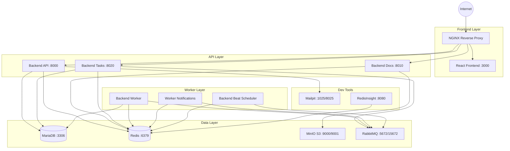

# 🐳 Docker Compose - Entorno de Desarrollo

Esta documentación describe la arquitectura y configuración del entorno de desarrollo del Sistema de Inventario usando Docker Compose.

## 📋 Tabla de Contenidos

- [Arquitectura General](#-arquitectura-general)
- [Servicios del Stack](#-servicios-del-stack)
- [Variables de Entorno](#-variables-de-entorno)
- [Redes y Volúmenes](#-redes-y-volúmenes)
- [Comandos Útiles](#-comandos-útiles)
- [Troubleshooting](#-troubleshooting)

## 🏗️ Arquitectura General

El sistema utiliza una arquitectura de microservicios con los siguientes componentes:



## 🚀 Servicios del Stack

### Frontend & Proxy

#### NGINX (Reverse Proxy)
- **Puerto**: 80
- **Función**: Reverse proxy y load balancer
- **Dependencias**: frontend, backend-api, backend-docs, backend-tasks
- **Health Check**: `nginx -t`

#### Frontend (React/NodeJS)
- **Puerto**: 3000
- **Tecnología**: Node.js 18-alpine
- **Función**: Interfaz de usuario React
- **Dependencias**: Todos los backends
- **Desarrollo**: Hot reload habilitado
- **Health Check**: HTTP GET /health

### Backend Services

#### Backend API
- **Puerto**: 8000
- **Tecnología**: Python 3.12 + FastAPI
- **Función**: API principal para consultas a base de datos
- **Dependencias**: MariaDB, Redis
- **Health Check**: HTTP GET /health
- **Features**: Auto-reload en desarrollo

#### Backend Docs
- **Puerto**: 8010
- **Tecnología**: Python 3.12 + FastAPI
- **Función**: Generación de documentos y conexión a MinIO
- **Dependencias**: MinIO, Redis
- **Health Check**: HTTP GET /health

#### Backend Tasks
- **Puerto**: 8020
- **Tecnología**: Python 3.12 + FastAPI
- **Función**: Gestión de tareas en segundo plano
- **Dependencias**: Redis, RabbitMQ, MariaDB
- **Health Check**: HTTP GET /health

### Workers & Processing

#### Backend Worker
- **Tecnología**: Python 3.12 + Celery
- **Función**: Procesador principal de colas
- **Dependencias**: Redis, RabbitMQ, MariaDB
- **Configuración**: 4 workers concurrentes
- **Colas**: default, high_priority, low_priority, notifications
- **Health Check**: `celery inspect ping`

#### Worker Notifications
- **Tecnología**: Python 3.12 + Celery
- **Función**: Procesador especializado en notificaciones
- **Dependencias**: Redis, RabbitMQ, backend-worker
- **Configuración**: 2 workers concurrentes
- **Cola específica**: notifications
- **Health Check**: `celery inspect ping`

#### Backend Beat
- **Tecnología**: Python 3.12 + Celery Beat
- **Función**: Planificador de tareas recurrentes
- **Dependencias**: Redis, RabbitMQ, backend-worker
- **Persistencia**: Schedule guardado en volumen

### Data Layer

#### MariaDB
- **Puerto**: 3306
- **Versión**: 10.6
- **Función**: Base de datos principal
- **Persistencia**: `./volumes/mariadb/db`
- **Inicialización**: Scripts en `./scripts/mariadb/entrypoint/`
- **Health Check**: MariaDB healthcheck.sh

#### Redis
- **Puerto**: 6379
- **Versión**: 7-alpine
- **Función**: Cache y broker de Celery
- **Configuración**: `./scripts/redis/redis.conf`
- **Persistencia**: RDB + AOF habilitado
- **Health Check**: `redis-cli ping`

#### MinIO
- **Puertos**: 9000 (API), 9001 (Console)
- **Función**: Almacenamiento de objetos S3-compatible
- **Configuración**: Scripts de inicialización automática
- **Buckets**: Configurados en `./scripts/minio/buckets.txt`
- **Health Check**: HTTP GET /minio/health/live

#### RabbitMQ
- **Puertos**: 5672 (AMQP), 15672 (Management)
- **Versión**: 4.0.5-management-alpine
- **Función**: Message broker para Celery
- **Configuración**: Definiciones pre-cargadas
- **Management UI**: http://localhost:15672
- **Health Check**: `rabbitmq-diagnostics ping`

### Development Tools

#### Mailpit
- **Puertos**: 1025 (SMTP), 8025 (Web UI)
- **Función**: Testing de emails en desarrollo
- **Web UI**: http://localhost:8025
- **Health Check**: HTTP GET /

#### RedisInsight
- **Puerto**: 8080
- **Función**: Interface web para Redis
- **Auto-configuración**: Conexión automática a Redis
- **Web UI**: http://localhost:8080

## 🔧 Variables de Entorno

### Archivos de Configuración

El sistema utiliza una jerarquía de archivos de entorno:

```
.env                 # Variables base compartidas
.env.dev            # Configuración específica de desarrollo
.env.qa             # Configuración específica de QA
.env.prd            # Configuración específica de producción
```

### Carga de Variables

```bash
# Orden de carga (el último sobrescribe)
docker compose --env-file .env --env-file .env.dev up -d
```

### Variables Principales

| **Categoría** | **Variable** | **Valor por Defecto** | **Descripción** |
|---------------|--------------|----------------------|------------------|
| **Proyecto** | `PROJECT_NAME` | `inventario` | Nombre del proyecto |
| **Proyecto** | `ENV` | `general` | Entorno actual |
| **Backend API** | `BACKEND_API_PORT` | `8000` | Puerto externo API |
| **Backend API** | `BACKEND_API_PORT_INTERNAL` | `8000` | Puerto interno API |
| **Frontend** | `FRONTEND_PORT` | `3000` | Puerto externo frontend |
| **Frontend** | `FRONTEND_PORT_INTERNAL` | `3000` | Puerto interno frontend |
| **MariaDB** | `MYSQL_PORT` | `3306` | Puerto de MariaDB |
| **MariaDB** | `MYSQL_DATABASE` | `inventario` | Base de datos principal |
| **Redis** | `REDIS_PORT` | `6379` | Puerto de Redis |
| **Redis** | `REDIS_PASSWORD` | `mipasswordsegura` | Contraseña de Redis |
| **RabbitMQ** | `RABBITMQ_PORT` | `5672` | Puerto AMQP |
| **RabbitMQ** | `RABBITMQ_UI_PORT` | `15672` | Puerto Management UI |
| **MinIO** | `MINIO_PORT` | `9000` | Puerto API MinIO |
| **MinIO** | `MINIO_CONSOLE_PORT` | `9001` | Puerto Console MinIO |

## 🌐 Redes y Volúmenes

### Redes Docker

#### Red Interna (`internal`)
- **Tipo**: Bridge
- **Subnet**: 172.20.0.0/16
- **Función**: Comunicación entre servicios
- **Servicios**: Todos excepto nginx

#### Red Externa (`external`)
- **Tipo**: Bridge
- **Subnet**: 192.168.55.0/24
- **Función**: Acceso desde el exterior
- **Servicios**: nginx

### Volúmenes de Persistencia

#### Volúmenes de Datos
```yaml
volumes:
  mariadb_data:     # Datos de MariaDB
  redis_data:       # Datos de Redis
  minio_data:       # Objetos de MinIO
  rabbitmq_data:    # Datos de RabbitMQ
  celerybeat_data:  # Schedule de Celery Beat
```

#### Bind Mounts de Desarrollo
```yaml
# Código fuente (hot reload)
./volumes/frontend:/app
./volumes/backend-api:/app
./volumes/backend-docs:/app
./volumes/backend-tasks:/app
./volumes/backend-worker:/app

# Configuraciones
./scripts/redis/redis.conf:/etc/redis/redis.conf:ro
./scripts/rabbitmq/:/etc/rabbitmq/:ro
./scripts/mariadb/entrypoint/:/docker-entrypoint-initdb.d/:ro

# Logs
./logs/nginx:/var/log/nginx
./logs/frontend:/var/log/app
./logs/backend-api:/var/log/app
# ... otros logs
```

## 🛠️ Comandos Útiles

### Gestión del Stack

```bash
# Iniciar el stack completo
docker compose -f docker-compose-dev.yml --env-file .env --env-file .env.dev up -d --build

# Detener el stack
docker compose -f docker-compose-dev.yml down

# Ver logs en tiempo real
docker compose -f docker-compose-dev.yml logs -f

# Ver logs de un servicio específico
docker compose -f docker-compose-dev.yml logs -f backend-api

# Reiniciar un servicio
docker compose -f docker-compose-dev.yml restart backend-api

# Ejecutar comando en contenedor
docker compose -f docker-compose-dev.yml exec backend-api bash
```

### Health Checks

```bash
# Verificar estado de todos los servicios
docker compose -f docker-compose-dev.yml ps

# Ver detalles de health checks
docker inspect $(docker compose -f docker-compose-dev.yml ps -q backend-api) | grep -A 10 "Health"
```

### Troubleshooting

```bash
# Ver recursos utilizados
docker stats

# Limpiar volúmenes huérfanos
docker volume prune

# Limpiar imágenes no utilizadas
docker image prune -a

# Rebuild completo
docker compose -f docker-compose-dev.yml down --volumes --rmi all
docker compose -f docker-compose-dev.yml up -d --build
```

## 🔍 Troubleshooting

### Problemas Comunes

#### 1. Servicios no inician correctamente
```bash
# Verificar logs del servicio
docker compose logs nombre-servicio

# Verificar configuración
docker compose config

# Verificar health checks
docker compose ps
```

#### 2. Problemas de conectividad entre servicios
```bash
# Verificar redes
docker network ls
docker network inspect inventario_internal

# Probar conectividad
docker compose exec backend-api ping redis
docker compose exec backend-api nslookup mariadb
```

#### 3. Problemas de permisos en volúmenes
```bash
# Verificar permisos
ls -la volumes/
sudo chown -R $USER:$USER volumes/

# Para desarrolladores en Windows
# Asegurar que Docker Desktop tenga acceso a las carpetas
```

#### 4. Puertos ocupados
```bash
# Verificar puertos en uso
netstat -tulpn | grep :8000
lsof -i :8000

# Cambiar puertos en .env si es necesario
BACKEND_API_PORT=8001
```

#### 5. Problemas de memoria
```bash
# Verificar uso de memoria
docker stats
free -h

# Ajustar límites en docker-compose-dev.yml
deploy:
  resources:
    limits:
      memory: "256M"
```

### Logs Importantes

#### Ubicación de Logs
```
logs/
├── nginx/          # Logs de Nginx
├── frontend/       # Logs del frontend
├── backend-api/    # Logs del backend API
├── backend-docs/   # Logs del backend docs
├── backend-tasks/  # Logs del backend tasks
├── backend-worker/ # Logs de Celery workers
├── mariadb/        # Logs de MariaDB
├── redis/          # Logs de Redis
├── rabbitmq/       # Logs de RabbitMQ
├── minio/          # Logs de MinIO
└── mailpit/        # Logs de Mailpit
```

### Health Check Endpoints

| **Servicio** | **Endpoint** | **Comando** |
|--------------|--------------|-------------|
| Backend API | `http://localhost:8000/health` | `curl -f http://localhost:8000/health` |
| Backend Docs | `http://localhost:8010/health` | `curl -f http://localhost:8010/health` |
| Backend Tasks | `http://localhost:8020/health` | `curl -f http://localhost:8020/health` |
| Frontend | `http://localhost:3000/health` | `curl -f http://localhost:3000/health` |
| Nginx | Configuración | `nginx -t` |
| Redis | Ping | `redis-cli ping` |
| MariaDB | Script interno | `healthcheck.sh --connect` |
| RabbitMQ | Diagnostics | `rabbitmq-diagnostics ping` |
| MinIO | Health endpoint | `curl -f http://localhost:9000/minio/health/live` |

### URLs de Desarrollo

| **Servicio** | **URL** | **Credenciales** |
|--------------|---------|------------------|
| **Frontend** | http://localhost:3000 | - |
| **API Docs** | http://localhost:8000/docs | - |
| **Nginx** | http://localhost:80 | - |
| **RabbitMQ Management** | http://localhost:15672 | `inventario_user` / `inventario_pass_2024` |
| **MinIO Console** | http://localhost:9001 | `minioadmin` / `minioadmin123` |
| **RedisInsight** | http://localhost:8080 | Auto-configurado |
| **Mailpit** | http://localhost:8025 | - |

---

## 📚 Referencias

- [Docker Compose Documentation](https://docs.docker.com/compose/)
- [FastAPI Documentation](https://fastapi.tiangolo.com/)
- [Celery Documentation](https://docs.celeryproject.org/)
- [React Documentation](https://reactjs.org/docs/)
- [MariaDB Documentation](https://mariadb.org/documentation/)
- [Redis Documentation](https://redis.io/documentation)
- [RabbitMQ Documentation](https://www.rabbitmq.com/documentation.html)
- [MinIO Documentation](https://docs.min.io/)